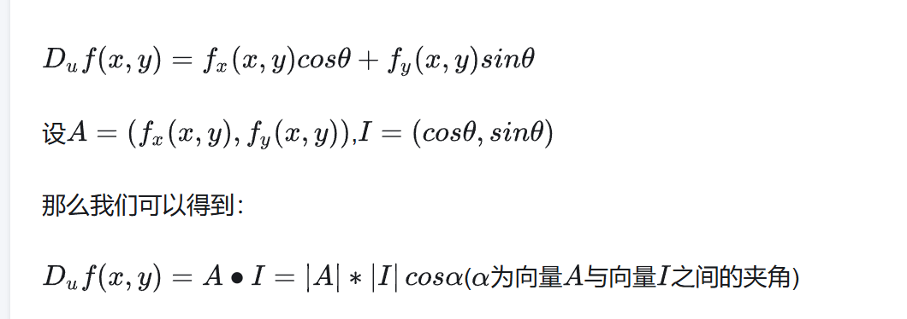

- 梯度下降算法
  - 梯度方向定义为**该点方向导数最大的方向**。注意该导数是带符号的，换句话说，**二维函数来说，在最小值的左边，其方向为负值。**
  - 方向导数就是各偏导数在该方向的分量相加。
  - **梯度方向是函数变化率最大的方向了！！！（因为本来就是把这个函数变化最大的方向命名为梯度）**这个变化方向是可能是高维空间中的任意方向，cosa要为1（-1），夹角要为0（180）.
  - 
  
  # 损失函数系列
  
  - 交叉熵与mse公式：
  
    MSE损失：$L=\frac{1}{N}\sum_{i}^{N}||y^{(i)}-\hat{y}^{(i)}||^2=\frac{1}{N}\sum_{i=1}^{N}\sum_{i=1}^{K}(y_k^i-\hat{y}_k^i)^2$
  
    交叉熵损失：$L=-\frac{1}{N}\sum_{i=1}^{N}\sum_{i=1}^{K}y_k^iln\hat{y}_k^i$
  
  - 分类为什么用交叉熵不用mse：
  
    - 梯度以及收敛难度的角度：
  
      1 在进行分类任务时，最后肯定需要一层激活层将输出值映射为0-1的概率分布，一般使用sigmoid/softmax。此时对w求偏导进行梯度反传，偏导值会带上sigmoid导数因子(因为sigmoid的上层输入x肯定也带w，因此要对sigmoid复合函数求导，最终带上了sigmoid导数因子)，该因子在输入值为较大/较小时容易梯度消失，不利于训练。2 另外MSE带入sigmoid因子后，该损失函数是一个非凸函数，有多个极值点，容易陷入局部最优。3 交叉熵在求导之后，导数因子直接化简为$\sigma(1-\sigma)$非常优雅，容易求导。
      $$
      L=\frac{1}{2n}(y-\hat{y})^2 \\
      \frac{\partial{L}}{\partial{w}} = \frac{1}{n}(y-\sigma(wx+b)^2)·x·\sigma' \\
      对于交叉熵求导 -\frac{1}{N}\sum_{i=1}^{N}\sum_{i=1}^{K}y_k^iln\hat{y}_k^i \\
      \frac{\partial{L}}{\partial{w}}=-\frac{p'}{p} \\
      对于sigmoid因子，有\frac{\sigma'}{\sigma}=\sigma(1-\sigma),从而规避了sigmoid导数因子的梯度消失问题
      $$
    
    - 从问题建模的角度：
    
      - MSE在数学上可以描述为2-范数，通常用来描述2维向量空间中，向量的长度(两个点的距离)，具有直接几何意义，这种一般用在回归/预测等任务更合适。 分类问题一般是通过softmax/sigmoid投影到0-1概率向量空间，**使用欧式空间精确度量方式去度量概率空间的距离不是一个最优的建模方式**，因此我这边理解MSE一般不用于分类。而对于回归、预测等精确值任务是一个合适的方式。
    
      - 为什么用交叉熵？
    
        - 对于两种分布的采样结果在概率空间中的距离，我们一般才有KL散度度量，
    
        - 如果我们把机器学习理解为一个极大似然估计的任务，即模型已定、参数未知，去最大化已有样本集的联合概率，则优化目标函数是$L(\theta_1, \theta_2,...,\theta_k) = p(x_1|\theta)p(x_2|\theta)...p(x_n|\theta)=\prod\limits_{i=1}^{n}p(x_i|\theta)$，将其化作对数似然函数恰好就是交叉熵公式。
    
      - 极大似然估计：处理模型已定、参数未知，最大化已有样本概率，则优化目标函数恰好就是交叉熵公式。
    
      - 分类问题本质上是一个分布的概率估计，基于训练分布模拟真实数据分布，从概率分布度量上看交叉熵合适；MSE实际上是2-范数
    
    - 从优化方向的角度：
    
      - 对于回归而言，要做定量，那么预测（0.8，0.2，0）和（0.8，0.1，0.1）肯定带来的损失不一样。而分类是定性，模型1和2的预测都对都正确了，就像楼主说的损失应该一样才对。(只关注正确类别的损失)
      - 从上述的公式可以看出，交叉熵的损失函数只和分类正确的预测结果有关系，而MSE的损失函数还和错误的分类有关系，该分类函数除了让正确的分类尽量变大，还会让错误的分类变得平均，但实际在分类问题中这个调整是没有必要的。
  
- 分布、KL散度和交叉熵

  - 衡量两个分布距离的变量应该具有非对称性，因为参照系（期望）不一样，对于距离的描述/感受也就不一样，应该是说我们对于张三和李四买土鸡蛋的期望不同，可能张三天天买2个土鸡蛋，而李四可能因为孩子满月昨天才买了6个土鸡蛋，而平时从来不买。|？统一参照系不可以吗。

  